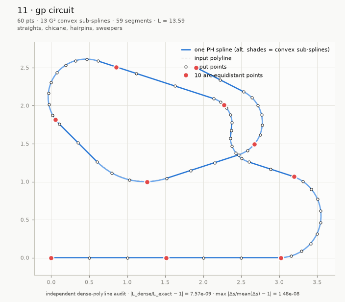
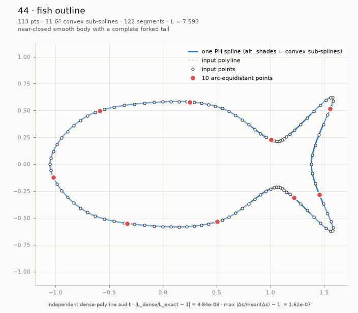
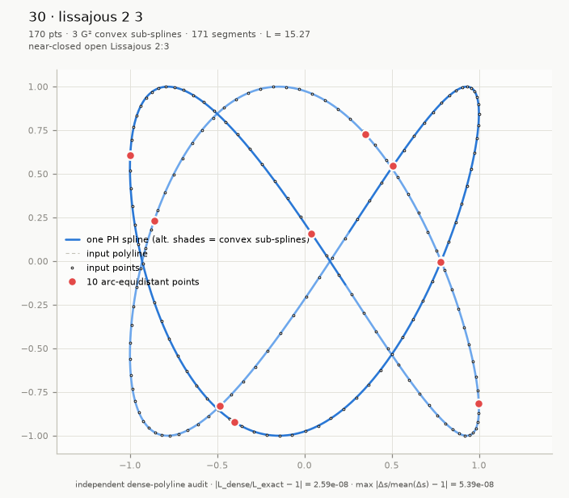
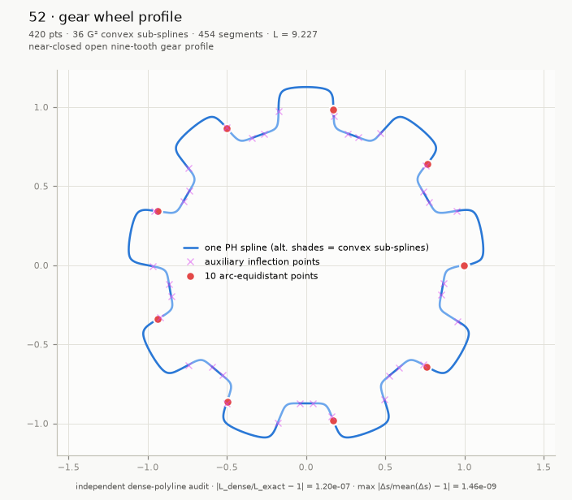
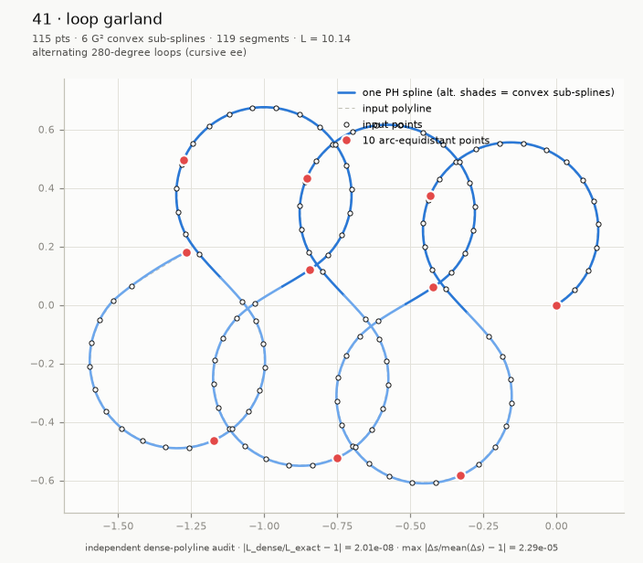

# Cubic PH Spline

Point-interpolating planar **cubic Pythagorean-hodograph (PH) splines** with
verified geometry, exact arc length and fast distance-domain evaluation.


*Locate any position by distance travelled or select two points an exact path
distance apart.*

`CubicPHSpline(points)` accepts convex, collinear and admissible nonconvex
point data directly, without requiring tangent or curvature data. It produces
an immutable regular spline that is G² throughout each convex run and G¹ only
at genuine curvature-sign changes and straight/curved transitions. Every
segment, continuity condition and numerical solve is independently verified
before construction succeeds.

The distinguishing feature is fast, accuracy-verified arc-length evaluation
for splines through arbitrary planar points: `point_at_length(d)` locates the
point reached after travelling `d` units, while queries at `s` and `s + d`
locate two points exactly `d` units of curve length apart. Each query uses one
O(log n) prefix lookup and a constant-cost closed-form inversion with bounded
polishing—without numerical quadrature or geometric search. Its arc-length
residual is verified near binary64 machine precision, and benchmarks remain
about 5-6 µs per query from 100 to 10,000 segments. To the best of our
knowledge, this is the first implementation for arbitrary planar-point splines
to combine closed-form arc-length inversion, near-machine-precision
verification and single-digit-microsecond random distance access.

```python
from cubic_ph_spline import CubicPHSpline

curve = CubicPHSpline([[0.0, 0.0], [1.0, 0.4], [2.0, 1.3], [2.6, 2.4]])

curve.point(0.5)               # float64 array (2,)
curve.tangent(0.5)             # unit tangent
curve.normal(0.5, side="left") # unit normal
curve.principal_normal(0.5)    # toward the center of curvature
curve.signed_curvature(0.5)    # float (sign = turning direction)
curve.curvature_vector(0.5)    # kappa * N_left
curve.aux_inflection_points    # [] (none inserted for this convex input)

L = curve.arc_length(1.0)      # exact (closed form, compensated prefix sums)
u = curve.parameter_at_length(0.5 * L)
curve.point_at_length(0.5 * L) # one locate + one inversion
```

## Gallery

| | |
|---|---|
|  |  |
| *One nonconvex racing-circuit spline.* | *Near-closed open fish outline.* |
|  |  |
| *Near-closed Lissajous 2:3.* | *Near-closed nine-tooth gear profile.* |
|  |  |
| *Hilbert path with supported straights and rounded corners.* | *Alternating 280-degree loops with verified global arc-length inversion.* |

## Where distance-domain evaluation matters

Fast, verified distance queries matter wherever work must be scheduled or
distributed uniformly along a path: contour design, CNC and robot motion,
autonomous navigation, constant-speed animation, spatial and GIS queries,
collision sampling, physical simulation, sensing, inspection, and placement
of textures, annotations or material along a curve.

## Numerical design highlights

- All construction in normalized coordinates (origin `P0`, scale = longest
  chord); hypot-based norms; chord-ratio representability guard.
- Closed-form, bitwise-deterministic nonconvex preprocessing. Auxiliary points
  are clamped to chord fractions `[1/16, 15/16]`; their prescribed tangents are
  never boundary-clamped, and every fallback retains a strictly positive tilt.
- Bounded trust-region tridiagonal solve for the internal tangent angles,
  with machine-precision complex-step Jacobians (three-coloring), a
  deterministic fallback initializer for extreme chord ratios, and a damped,
  box-projected Newton polish. Solver output is never trusted: strict
  independent acceptance (residual gate `1e-11`, regularity, control-polygon
  admissibility, PH reconstruction with conditioning-aware tolerance, and
  per-joint G²/G¹ verification) follows every solve.
- Cancellation-resistant closed forms throughout: `sinc`-based angle ratios,
  rationalized quadratic roots chosen per branch sign, completed-square arc
  length, scaled hyperbolic/Cardano depressed-cubic inversion with
  factored recovery of `t` (never `y - h`), end-reversed inversion near
  `t = 1`, safeguarded Newton with a fixed iteration bound and an explicit
  arc-length residual gate `64 eps L + 4 ulp(s)`.
- Works verified from coordinate magnitudes `1e-150` to `1e307`, curvatures
  `1e-12` to `1e12`, chord ratios down to ~`5e-13`, and systems beyond 1000
  segments (sparse banded path).

## API

All parameters and lengths are Python or NumPy real scalars. Coordinates and
vectors are returned as NumPy `float64` arrays of shape `(2,)`.

| Call | Result |
|---|---|
| `CubicPHSpline(points)` | Construct an immutable open spline from an `(n, 2)` point sequence. |
| `point(u)` | Position at global parameter `u` in `[0, 1]`. |
| `tangent(u)` | Unit traversal tangent. |
| `normal(u, side="left")` | Unit left or right normal. |
| `principal_normal(u)` | Unit normal toward the center of curvature; undefined on a straight segment. |
| `signed_curvature(u)` | Signed scalar curvature. |
| `curvature_vector(u)` | Left normal multiplied by signed curvature. |
| `aux_inflection_points` | Algorithm-inserted inflection points as `{"u", "s", "x", "y"}` dicts. |
| `arc_length(u)` | Length from the start through parameter `u`. |
| `parameter_at_length(s)` | Parameter whose prefix length is `s`, for `s` in `[0, arc_length(1)]`. |
| `point_at_length(s)` | Position at prefix length `s`. |

All package exceptions derive from `CubicPHSplineError`. Invalid input and
query arguments also derive from `ValueError`; numerical construction and
inversion failures also derive from `RuntimeError`. Construction exceptions
provide `index`, `quantity`, `value`, and `bound` diagnostic attributes.

## Benchmarks

`python benchmarks/benchmark.py` compares a strictly convex log spiral with a
one-inflection cubic S curve, best of three on Windows 11 / Python 3.14.6 /
NumPy 2.x. Both paths include their complete construction and verification
contracts. Queries use seeded uniform arc lengths.

| kind | points | segments | aux | construction | 1000 × `point_at_length` | per query |
|:-----|-------:|---------:|----:|-------------:|-------------------------:|----------:|
| convex | 100 | 99 | 0 | 0.022 s | 5.8 ms | 5.8 µs |
| nonconvex | 100 | 100 | 1 | 0.022 s | 5.7 ms | 5.7 µs |
| convex | 1 000 | 999 | 0 | 0.029 s | 5.7 ms | 5.7 µs |
| nonconvex | 1 000 | 1 000 | 1 | 0.047 s | 5.7 ms | 5.7 µs |
| convex | 10 000 | 9 999 | 0 | 0.373 s | 6.1 ms | 6.1 µs |
| nonconvex | 10 000 | 10 000 | 1 | 0.337 s | 5.8 ms | 5.8 µs |

Construction stays in the same range for the two contracts. Query cost is
nearly flat over the tested sizes: one O(log n) prefix search plus one
constant-cost elementary local inversion, never an iterative geometric search.

## References

- Jaklič, Kozak, Krajnc, Vitrih and Žagar, [*On interpolation by planar cubic
  G² Pythagorean-hodograph spline curves*](https://users.fmf.uni-lj.si/knez/clanki/CubicPHG2Spline-rev.pdf).
- Albrecht, Beccari, Canonne and Romani, [*Pythagorean-Hodograph B-Spline
  Curves* (PDF)](https://arxiv.org/pdf/1609.07888) and
  [abstract/metadata](https://arxiv.org/abs/1609.07888).
- Farouki, [*Arc lengths of rational Pythagorean-hodograph
  curves*](https://escholarship.org/content/qt90s84043/qt90s84043.pdf).
- Farouki and Sakkalis, [*Real rational curves are not ‘unit
  speed’*](https://doi.org/10.1016/0167-8396(91)90040-I).
- Knez, Pelosi and Sampoli, [*Construction of G² planar Hermite interpolants
  with prescribed arc lengths*](https://arxiv.org/pdf/2202.11371).
- Gajny, Béarée, Nyiri and Gibaru, [*Path planning with PH G² splines in
  R²*](https://doi.org/10.1109/IConSCS.2012.6502455).
