# PH Splines

This Python package provides planar Pythagorean-hodograph (PH) splines
[[1]](#ref-1) [[4]](#ref-4) in cubic [[5]](#ref-5) and B-spline
[[8]](#ref-8) forms, focused on distance-based queries like
the `point_at_length` API. Their defining PH
property makes speed polynomial, so arc length is an exactly evaluable
piecewise-polynomial function of the spline parameter, making random distance access
convenient, efficient and robust without demanding numerical quadrature.

- Cubic PH Spline (`CubicPHSplineOpen`, `CubicPHSplineClosed`) is highly efficient for static use cases.
- PH B-spline (`PHBSplineOpen`, `PHBSplineClosed`) supports dynamic editing (moving, adding and deleting nodes) with prescribed continuity-order constraints.

Both families also expose **exact parallel offsets**: `curve.offset(d)` compiles
the true offset curve as a verified read-only rational NURBS, with no sampling
or fitting. This exact rationality of offsets is a defining PH property that
ordinary polynomial splines do not have.

## 1. Cubic PH Spline

Point-interpolating planar **cubic Pythagorean-hodograph (PH) splines** with
verified geometry, exact arc length, closed-form arc-length inversion and
exact rational NURBS offsets.

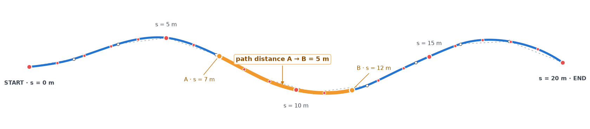

*Locate any position by distance travelled or select two points an exact path
distance apart.*

`CubicPHSplineOpen(points)` accepts convex, collinear and admissible nonconvex
point data directly, without requiring tangent or curvature data.
`CubicPHSplineClosed(points)` accepts cyclic data without a repeated final
point. Strictly convex cycles use a square cyclic solve and are G² at every
join. General cycles reuse the same auxiliary subsegment construction as the
open class: the seam remains G², convex runs remain G², and only genuine
curvature-sign changes and straight/curved transitions are G¹. Every segment,
declared continuity condition and numerical solve is independently verified.

The distinguishing feature is fast, accuracy-verified arc-length evaluation
for splines through arbitrary planar points: `point_at_length(d)` locates the
point reached after travelling `d` units, while queries at `s` and `s + d`
locate two points exactly `d` units of curve length apart. Each query uses one
O(log n) prefix lookup and a constant-cost closed-form inversion with bounded
polishing—without numerical quadrature or geometric search. Its arc-length
residual is verified near binary64 machine precision, and benchmarks remain
about 5-6 µs per query from 100 to 10,000 segments. To the best of our
knowledge, this is the first implementation for arbitrary planar-point splines
to combine closed-form arc-length inversion, near-machine-precision
verification and single-digit-microsecond random distance access.

```python
from ph_spline import CubicPHSplineOpen

curve = CubicPHSplineOpen([[0.0, 0.0], [1.0, 0.4], [2.0, 1.3], [2.6, 2.4]])

curve.point(0.5)               # float64 array (2,)
curve.tangent(0.5)             # unit tangent
curve.normal(0.5, side="left") # unit normal
curve.principal_normal(0.5)    # toward the center of curvature
curve.signed_curvature(0.5)    # float (sign = turning direction)
curve.curvature_vector(0.5)    # kappa * N_left
curve.aux_inflection_points    # [] (none inserted for this convex input)

L = curve.arc_length(1.0)      # exact (closed form, compensated prefix sums)
u = curve.parameter_at_length(0.5 * L)
curve.point_at_length(0.5 * L) # one locate + one inversion
```

```python
import numpy as np
from ph_spline import CubicPHSplineClosed

loop = CubicPHSplineClosed([[1.0, 0.0], [0.0, 1.0], [-1.0, 0.0], [0.0, -1.0]])

# Exact minimal curvature radii: offsets are cusp-free for
# -rho_right < d < rho_left (closed form, O(1) after construction).
rho_left, rho_right = loop.min_curvature_radii

# Exact parallel curve as a verified rational quintic NURBS.
# Positive distance is to the traversal-left side; zero and negative work too.
ring = loop.offset(0.25)
assert ring.degree == 5 and ring.domain == (0.0, 1.0) and ring.closed
u = 0.37
assert np.allclose(ring.point(u), loop.point(u) + 0.25 * loop.normal(u))
```

### Gallery

| | |
|---|---|
| 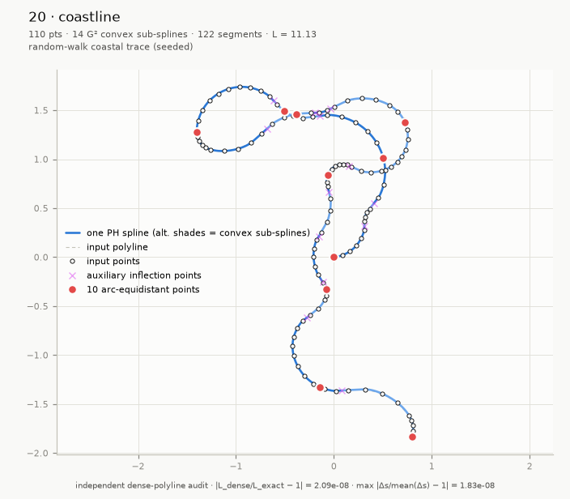 | 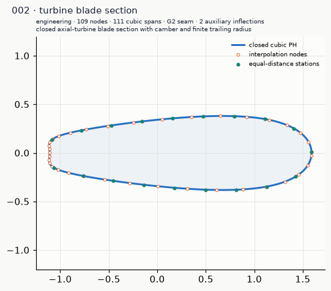 |
| *An open, random-walk coastline with tight coves, broad headlands and many inflections.* | *A cambered axial-turbine section with a finite trailing-edge radius.* |
| 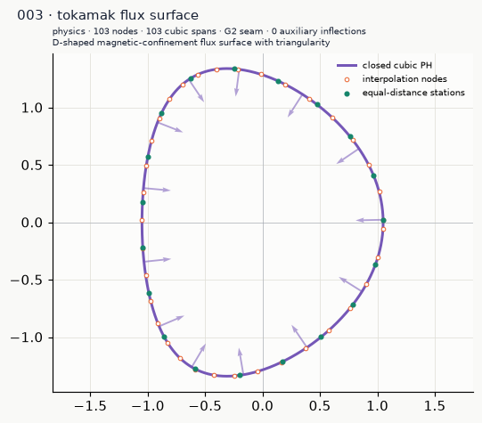 | 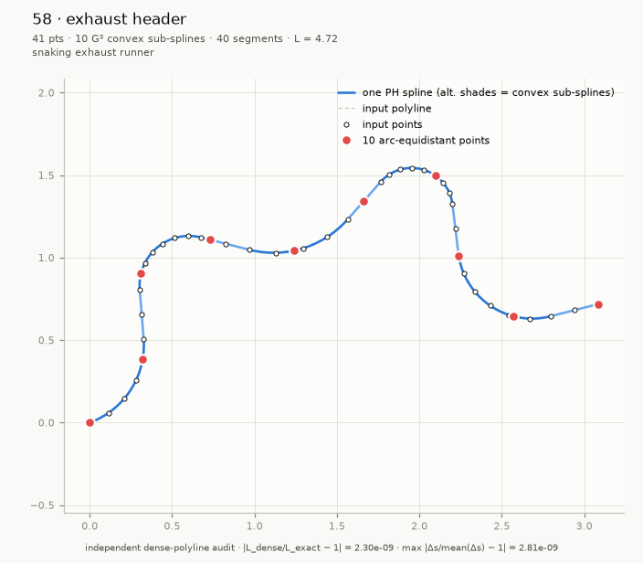 |
| *A D-shaped magnetic-confinement surface with curvature vectors.* | *An open, asymmetric exhaust runner with alternating bends and distance stations.* |
| 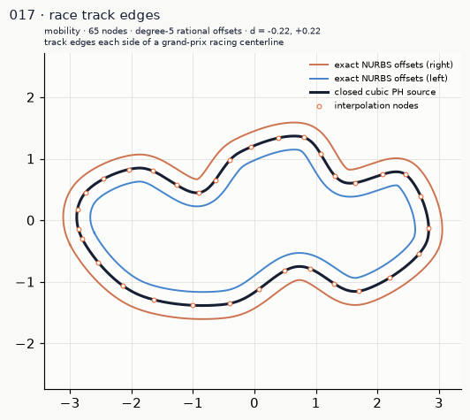 | 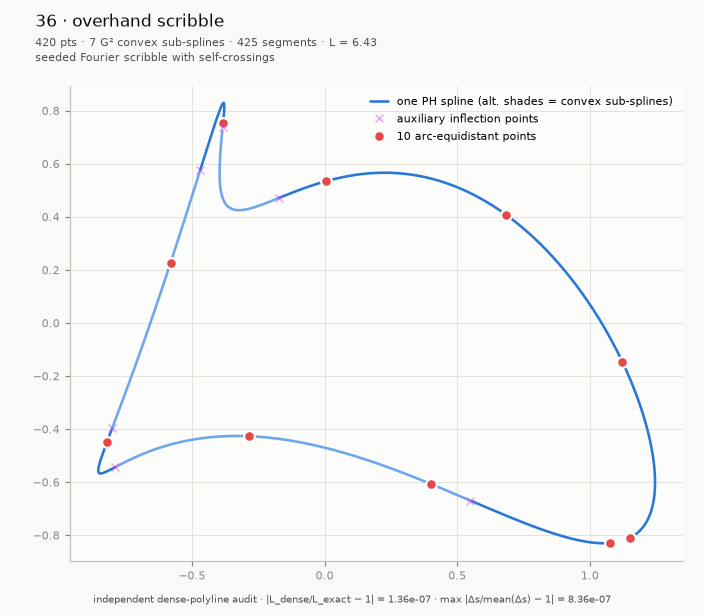 |
| *Exact rational NURBS offsets tracing both track edges of a grand-prix centerline.* | *An irregular open trace with self-crossings, tight reversals and broad sweeping arcs.* |

### Where distance-domain evaluation matters

Fast, verified distance queries matter wherever work must be scheduled or
distributed uniformly along a path: contour design, CNC and robot motion,
autonomous navigation, constant-speed animation, spatial and GIS queries,
collision sampling, physical simulation, sensing, inspection, and placement
of textures, annotations or material along a curve.

### Where exact offsets matter

Exact rational offsets serve everywhere a parallel curve is a requirement,
not a decoration: CNC cutter-radius compensation, stepover and pocketing
plans, wire-EDM and laser kerf allowance, trajectory optimization under
clearance constraints, robot and AGV safety corridors, boundary-layer mesh
inflation, mold shrink compensation, coverage and buffer zoning, tolerance
bands, and lossless export to CAD/CAM as an ordinary NURBS. Both families
also report `min_curvature_radii`, the exact smallest left/right curvature
radii: offsets are cusp-free precisely for `-rho_right < d < rho_left`. The
[`examples/cubic_offset`](examples/cubic_offset) and
[`examples/cubic_closed_offset`](examples/cubic_closed_offset) galleries
render 64 verified offset studies across these domains, and
[`examples/min_radii`](examples/min_radii) shows the cusp onset arriving
exactly at the reported radii for all four spline varieties.

### Background

Write a planar polynomial curve as `z(t) = x(t) + iy(t)`, with velocity
`z'(t)`. Its speed `sqrt(x'(t)^2 + y'(t)^2)` is generally not polynomial. A PH
curve instead makes `|z'(t)|^2 = x'(t)^2 + y'(t)^2 = sigma(t)^2`, so speed and
its arc-length integral are polynomials.

This implementation joins planar cubic PH Bézier segments with complex form
`z'(t) = (a + bt)^2`. Their speed `|a + bt|^2` is quadratic, so arc length is
cubic; distance inversion is one monotone cubic solve, expressible with cube
roots or hyperbolic functions. Bounded Newton iterations only correct rounding.

### Design details

- Construction is deterministic: starts, branches, auxiliary fallbacks and
  ties are fixed. Identical binary64 input produces identical coefficients in
  the same package/dependency version and execution architecture.
- Regular cubic PH curvature cannot change sign, so a G² spline without
  auxiliary points is a convex curved run or a straight run. This is the
  setting of [Jaklič et al.'s cubic PH G² construction](https://users.fmf.uni-lj.si/knez/clanki/CubicPHG2Spline-rev.pdf).
- At each polygon inflection, the paper's Section 6 construction inserts a
  chord point and tangent from the local four-point cubic. This implementation
  fixes its open choices—chord-length parametrization, a `[1/16, 15/16]`
  clamp, and a deterministic midpoint fallback—giving a G¹ sign-change joint
  between G² convex runs.
- Open endpoint tangents use the deterministic local-circumcircle convention.
  A closed cycle has no independently chosen boundary tangents: its cyclic
  solve, after any auxiliary partition, uses fixed start and branch ordering
  to select one reproducible accepted root, even if several isolated roots
  exist mathematically.
- Bounded trust-region tridiagonal solve for the internal tangent angles,
  with machine-precision complex-step Jacobians (three-coloring), a
  deterministic fallback initializer for extreme chord ratios, and a damped,
  box-projected Newton polish. Solver output is never trusted: strict
  independent acceptance (residual gate `1e-11`, regularity, control-polygon
  admissibility, PH reconstruction with conditioning-aware tolerance, and
  per-joint G²/G¹ verification) follows every solve.
- Cancellation-resistant closed forms throughout: `sinc`-based angle ratios,
  rationalized quadratic roots chosen per branch sign, completed-square arc
  length, scaled hyperbolic/Cardano depressed-cubic inversion with
  factored recovery of `t` (never `y - h`), end-reversed inversion near
  `t = 1`, safeguarded Newton with a fixed iteration bound and an explicit
  arc-length residual gate `64 eps L + 4 ulp(s)`.
- `offset(d)` compiles the exact rational quintic offset from homogeneous
  Bernstein products of the stored speed and hodograph, refines Bernstein
  weights to strict positivity by deterministic midpoint subdivision, and
  independently verifies structure, coefficients and sampled geometry before
  publishing an immutable handle. Cusps and self-intersections of the true
  parallel curve are kept exactly, never trimmed or smoothed.
- Works verified from coordinate magnitudes `1e-150` to `1e307`, curvatures
  `1e-12` to `1e12`, chord ratios down to ~`5e-13`, and systems beyond 1000
  segments (sparse banded path).

### Benchmarks

`python benchmarks/benchmark.py` compares a strictly convex log spiral with a
one-inflection cubic S curve, best of three on Windows 11 / Python 3.14.6 /
NumPy 2.x. Both paths include their complete construction and verification
contracts. Queries use seeded uniform arc lengths.

| kind | points | segments | aux | construction | 1000 × `point_at_length` | per query |
|:-----|-------:|---------:|----:|-------------:|-------------------------:|----------:|
| convex | 100 | 99 | 0 | 0.022 s | 5.8 ms | 5.8 µs |
| nonconvex | 100 | 100 | 1 | 0.022 s | 5.7 ms | 5.7 µs |
| convex | 1 000 | 999 | 0 | 0.029 s | 5.7 ms | 5.7 µs |
| nonconvex | 1 000 | 1 000 | 1 | 0.047 s | 5.7 ms | 5.7 µs |
| convex | 10 000 | 9 999 | 0 | 0.373 s | 6.1 ms | 6.1 µs |
| nonconvex | 10 000 | 10 000 | 1 | 0.337 s | 5.8 ms | 5.8 µs |

Construction stays in the same range for the two contracts. Query cost is
nearly flat over the tested sizes: one O(log n) prefix search plus one
constant-cost elementary local inversion, never an iterative geometric search.

## 2. PH B-spline

The PH B-spline family is the editable, variable-order counterpart.
`PHBSplineOpen` and `PHBSplineClosed` accurately interpolate their respective
planar point topologies, verify the requested continuity and
regularity before publication, and retain analytic PH speed and arc-length
polynomials on every span. The default request is G²; `g_order`, `c_order` and
`curvature_order` select higher geometric, parametric or arc-length-curvature
continuity. The minimum sufficient preimage order is selected directly as
`max(2, g_order, c_order, curvature_order + 2)`, giving PH degree
`2 * order + 1`; a simple midpoint knot supplies shape freedom without
inflating that degree. `offset(d)` works at every order and compiles the
exact parallel curve as a read-only rational NURBS of degree `4 * order + 1`.

```python
import numpy as np
from ph_spline import PHBSplineOpen

curve = PHBSplineOpen(
    [[0.0, 0.0], [1.0, 0.4], [2.0, -0.7], [3.0, 1.1], [2.2, 2.0]],
    g_order=4,
)

# Analytic distance access is retained at variable degree.
midpoint = curve.point_at_length(0.5 * curve.length)

# Exact parallel curve as a read-only rational NURBS of degree 4m + 1;
# min_curvature_radii bounds the cusp-free distance range on each side.
rho_left, rho_right = curve.min_curvature_radii
shell = curve.offset(0.2)
assert shell.degree == 4 * curve.preimage_degree + 1
assert np.allclose(shell.point(0.4), curve.point(0.4) + 0.2 * curve.normal(0.4))

# Handles survive insertion and index shifts; edits commit atomically.
handle = curve.point_handle(2)
report = curve.move_point(handle, [2.1, -0.9])
inserted = curve.insert_point(3, [2.6, 0.1])
curve.delete_point(inserted.handle)

# Several edits can share one verified commit.
with curve.edit() as edit:
    edit.move_point(handle, [2.0, -0.8])
    edit.insert_point(3, [2.5, 0.2])

snapshot = curve.snapshot()  # immutable query-only view
stations = snapshot.points_at_length(
    np.linspace(0.0, snapshot.length, 1000), assume_sorted=True
)
```

### Gallery

The isolated [`examples/bspline`](examples/bspline) directory contains
generators and rendered output for all 224 referenced input cases, plus 128 PH
B-spline-specific cases in eight feature families. The
[`examples/bspline_offset`](examples/bspline_offset) and
[`examples/bspline_closed_offset`](examples/bspline_closed_offset) galleries
add 64 verified exact-offset studies, several at G3 and G4 continuity.

| | |
|---|---|
| 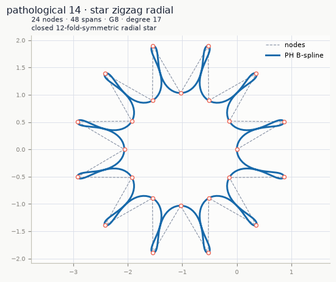 | 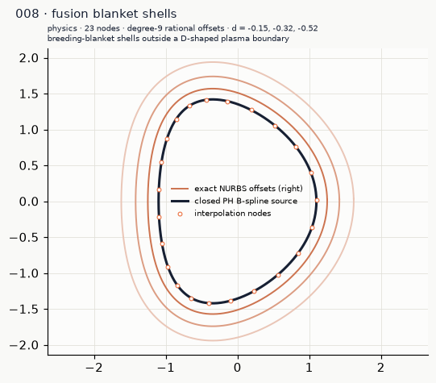 |
| *A closed, symmetric radial zigzag star built from degree-17 G8 PH spans.* | *Nested degree-9 rational offset shells outside a D-shaped fusion plasma boundary.* |
| 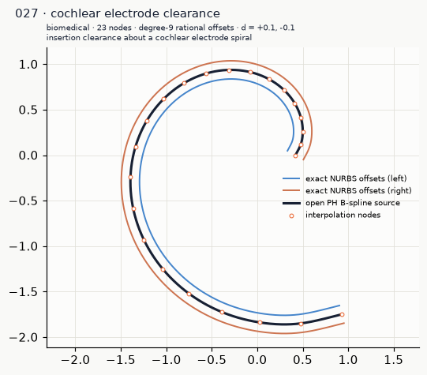 | 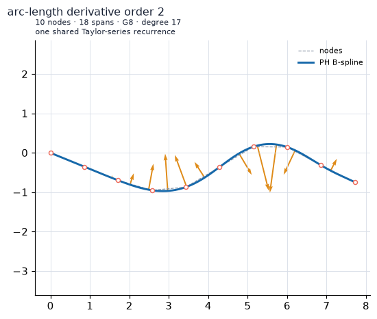 |
| *Two-sided insertion clearance walls about a cochlear electrode spiral.* | *The G8 curvature vector: the centripetal-force vector.* |

### Editing and higher-order geometry

Move, insertion and deletion rebuild a bounded coefficient neighborhood and
structurally share unchanged span arrays. Stable `PointHandle` values are not
renumbered by insertion; deleted handles and pre-edit `CurveLocation` values
raise typed stale-reference errors. `repair="strict_local"` is the default and
never silently becomes a global rebuild. `repair="expand"` admits a larger
configured patch, while `repair="global"` makes full reconstruction explicit.
Failed edits leave points, handles, spans, version and cached metric data
unchanged.

`derivative(u, order)` evaluates derivatives with respect to the normalized
spline parameter `u`. `curvature_vector(u, order)` returns parameter
derivatives of the complete curvature vector—not only derivatives of scalar curvature—and
`curvature_vector_jet` shares one Taylor-series recurrence. The elementary
Bernstein/preimage product identities are used directly; finite-difference
geometry and numerical quadrature are absent from these kernels.

### Design details

- Construction is deterministic minimum-norm projection from a parameterized
  secant guide. Open root signs are chosen consecutively; closed signs and seam
  lift use a fixed two-state search. No strain, elastica, length or curvature
  objective is applied.
- The requested continuity fixes the minimum preimage degree, and one midpoint
  knot per input interval supplies shape freedom. The complex preimage model
  follows [Albrecht et al.'s PH B-spline construction](https://arxiv.org/abs/1609.07888);
  the degree and knot rules are implementation conventions.
- Analytic displacement constraints produce one authoritative Bernstein
  preimage per span; position, polynomial speed and exact arc length follow by
  finite products and antiderivatives.
- Recursive Bernstein-box bounds certify regularity, while canonical endpoint
  preimage jets stabilize high-order join evaluation.
- Arc inversion uses a monotone span lookup, a linear bracket seed and bounded
  safeguarded Newton/bisection with a final forward-residual check.
- `offset(d)` reuses one shared verified pipeline at every continuity order:
  it emits a degree `4m + 1` rational NURBS whose positive denominator is the
  PH speed itself, captures one committed source version atomically, and the
  returned handle stays valid and bitwise unchanged through later edits.
- Construction and edits publish only finite, verified curves; requested
  continuity and degree are never silently downgraded.

### Benchmarks: size and shape

`python benchmarks/benchmark_bspline.py` prints all three tables below. These
construction figures are best-of-two below 10,000 nodes and single-run at
10,000 nodes; distance-query figures are best-of-three measurements on a
13th Gen Intel Core i9-13900K running Windows 11, Python 3.14.6, NumPy 2.5.1
and SciPy 1.18.0.
Each random distance result includes lookup, analytic polynomial inversion,
forward residual acceptance and point evaluation.

| kind | nodes | spans | construction | `point_at_length` |
|:--|--:|--:|--:|--:|
| convex | 100 | 198 | 0.0405 s | 56.96 µs |
| nonconvex | 100 | 198 | 0.0399 s | 55.61 µs |
| convex | 1,000 | 1,998 | 0.3981 s | 45.69 µs |
| nonconvex | 1,000 | 1,998 | 0.3609 s | 46.06 µs |
| convex | 10,000 | 19,998 | 3.6540 s | 47.44 µs |
| nonconvex | 10,000 | 19,998 | 3.5769 s | 46.10 µs |

Random distance access remains nearly flat as span count grows; its higher
constant than `CubicPHSplineOpen` buys variable degree, generic regular geometry
and editable state.

### Benchmarks: higher continuity

The second sweep fixes 1,000 nodes and raises the verified continuity request.
Both construction and distance-query cost rise with polynomial degree, rather
than with a hidden iterative quadrature tolerance.

| continuity | PH degree | construction | `point_at_length` |
|:--|--:|--:|--:|
| G3 | 7 | 0.4747 s | 58.23 µs |
| G4 | 9 | 0.6006 s | 65.11 µs |
| G6 | 13 | 0.9142 s | 118.02 µs |
| G8 | 17 | 1.2785 s | 145.36 µs |

### Benchmarks: dynamic editing

These are median end-to-end latencies from seven warmed calls to the public
editing API. They include validation, candidate construction, independent
verification and atomic commit. Exterior span polynomials, arc-length tables
and inverse kernels remain bitwise shared. With the current one-midpoint basis,
a single-node strict-local Gρ edit rebuilds `2(ρ + 3)` compiled spans:
10/14/22 for G2/G4/G8. The current flat-array commit path still
performs O(n) validation, prefix rebuilding and publication, so the table
reports actual user-visible latency rather than presenting bounded numerical
recompilation as total-size-independent execution.

| nodes | continuity | median move | median insert | median delete | rebuilt spans |
|--:|:--|--:|--:|--:|:--|
| 100 | G2 | 3.70 ms | 3.88 ms | 3.71 ms | 10/10/10 |
| 100 | G4 | 5.90 ms | 6.54 ms | 6.50 ms | 14/14/14 |
| 100 | G8 | 17.02 ms | 17.29 ms | 17.31 ms | 22/22/22 |
| 1,000 | G2 | 8.83 ms | 11.95 ms | 11.34 ms | 10/10/10 |
| 1,000 | G4 | 11.11 ms | 13.77 ms | 13.01 ms | 14/14/14 |
| 1,000 | G8 | 19.35 ms | 23.04 ms | 22.16 ms | 22/22/22 |
| 10,000 | G2 | 59.50 ms | 92.92 ms | 91.28 ms | 10/10/10 |
| 10,000 | G4 | 60.69 ms | 94.32 ms | 93.19 ms | 14/14/14 |
| 10,000 | G8 | 69.95 ms | 103.73 ms | 101.58 ms | 22/22/22 |

## References

1. <a id="ref-1"></a>Farouki, R. T., & Sakkalis, T. (1990). [Pythagorean
   hodographs](https://doi.org/10.1147/rd.345.0736). *IBM Journal of Research
   and Development*, *34*(5), 736–752.
2. <a id="ref-2"></a>Farouki, R. T., & Sakkalis, T. (1991). [Real rational curves are not ‘unit
   speed’](https://doi.org/10.1016/0167-8396(91)90040-I). *Computer Aided
   Geometric Design*, *8*(2), 151–157.
3. <a id="ref-3"></a>Farouki, R. T. (1992). [Pythagorean-hodograph curves in practical
   use](https://doi.org/10.1137/1.9781611971668.ch1). In *Geometry Processing
   for Design and Manufacturing* (pp. 3–33). SIAM.
4. <a id="ref-4"></a>Albrecht, G., & Farouki, R. T. (1996). [Construction of C²
   Pythagorean-hodograph interpolating splines by the homotopy
   method](https://doi.org/10.1007/BF02124754). *Advances in Computational
   Mathematics*, *5*, 417–442.
5. <a id="ref-5"></a>Jaklič, G., Kozak, J., Krajnc, M., Vitrih, V., & Žagar, E. (2010). [On
   interpolation by planar cubic G² Pythagorean-hodograph spline
   curves](https://doi.org/10.1090/S0025-5718-09-02298-4). *Mathematics of
   Computation*, *79*(269), 305–326.
6. <a id="ref-6"></a>Gajny, L., Béarée, R., Nyiri, E., & Gibaru, O. (2012). [Path planning with
   PH G² splines in R²](https://doi.org/10.1109/IConSCS.2012.6502455).
   *Proceedings of the 1st International Conference on Systems and Computer
   Science*. IEEE.
7. <a id="ref-7"></a>Farouki, R. T. (2015). [Arc lengths of rational Pythagorean-hodograph
   curves](https://doi.org/10.1016/j.cagd.2015.03.007). *Computer Aided
   Geometric Design*, *34*, 1–4.
8. <a id="ref-8"></a>Albrecht, G., Beccari, C. V., Canonne, J.-C., & Romani, L. (2017). [Planar
   Pythagorean-Hodograph B-Spline
   curves](https://doi.org/10.1016/j.cagd.2017.09.001). *Computer Aided
   Geometric Design*, *57*, 57–77.
9. <a id="ref-9"></a>Knez, M., Pelosi, F., & Sampoli, M. L. (2022). [Construction of G² planar
   Hermite interpolants with prescribed arc
   lengths](https://doi.org/10.1016/j.amc.2022.127092). *Applied Mathematics
   and Computation*, *426*, 127092.

## Appendix: API

### Cubic PH spline

<table width="100%">
  <thead>
    <tr>
      <th width="62%">Signature or property</th>
      <th width="38%">Purpose</th>
    </tr>
  </thead>
  <tbody>
    <tr><td><code>CubicPHSplineOpen(points: PointSequence)</code></td><td>Construct an immutable open interpolant.</td></tr>
    <tr><td><code>CubicPHSplineClosed(points: PointSequence)</code></td><td>Construct an immutable cyclic interpolant; list the seam point once.</td></tr>
    <tr><td><code>.closed -&gt; bool</code></td><td>Whether the spline is cyclic.</td></tr>
    <tr><td><code>.degree -&gt; int</code></td><td>Polynomial degree (<code>3</code>).</td></tr>
    <tr><td><code>.num_points -&gt; int</code></td><td>Number of input points.</td></tr>
    <tr><td><code>.length -&gt; float</code></td><td>Total arc length.</td></tr>
    <tr><td><code>.aux_inflection_points -&gt; list[dict[str, float]]</code></td><td>Inserted inflections as <code>u</code>, <code>s</code>, <code>x</code>, <code>y</code> records.</td></tr>
    <tr><td><code>point(u: Real) -&gt; NDArray</code></td><td>Position at normalized parameter <code>u</code>.</td></tr>
    <tr><td><code>tangent(u: Real) -&gt; NDArray</code></td><td>Unit tangent.</td></tr>
    <tr><td><code>normal(u: Real, side: Literal["left", "right"] = "left") -&gt; NDArray</code></td><td>Oriented unit normal.</td></tr>
    <tr><td><code>principal_normal(u: Real) -&gt; NDArray</code></td><td>Unit normal toward the curvature center.</td></tr>
    <tr><td><code>signed_curvature(u: Real) -&gt; float</code></td><td>Signed scalar curvature.</td></tr>
    <tr><td><code>curvature_vector(u: Real) -&gt; NDArray</code></td><td>Curvature times the left normal.</td></tr>
    <tr><td><code>arc_length(u: Real) -&gt; float</code></td><td>Length from <code>u=0</code> to <code>u</code>.</td></tr>
    <tr><td><code>parameter_at_length(s: Real) -&gt; float</code></td><td>Parameter at travelled length <code>s</code>.</td></tr>
    <tr><td><code>point_at_length(s: Real) -&gt; NDArray</code></td><td>Position at travelled length <code>s</code>.</td></tr>
    <tr><td><code>offset(distance: Real) -&gt; NURBSHandle</code></td><td>Exact parallel curve as a verified rational quintic NURBS.</td></tr>
    <tr><td><code>.min_curvature_radii -&gt; tuple[float, float]</code></td><td>Exact smallest left/right curvature radii; cusp-free offset range.</td></tr>
  </tbody>
</table>

### PH B-spline

#### Construction and properties

<table width="100%">
  <thead>
    <tr>
      <th width="63%">Signature or property</th>
      <th width="37%">Purpose</th>
    </tr>
  </thead>
  <tbody>
    <tr><td><code>PHBSplineOpen(points: ArrayLike, *, g_order: Optional[int] = None, c_order: Optional[int] = None, curvature_order: Optional[int] = None)</code></td><td>Construct a mutable open interpolant.</td></tr>
    <tr><td><code>PHBSplineClosed(points: ArrayLike, *, g_order: Optional[int] = None, c_order: Optional[int] = None, curvature_order: Optional[int] = None)</code></td><td>Construct a mutable cyclic interpolant.</td></tr>
    <tr><td><code>.closed -&gt; bool</code></td><td>Whether the spline is cyclic.</td></tr>
    <tr><td><code>.points -&gt; NDArray[np.float64]</code></td><td>Read-only copy of interpolation points.</td></tr>
    <tr><td><code>.point_handles -&gt; tuple[PointHandle, ...]</code></td><td>Stable handles in current point order.</td></tr>
    <tr><td><code>.num_points -&gt; int</code></td><td>Number of interpolation points.</td></tr>
    <tr><td><code>.num_spans -&gt; int</code></td><td>Number of compiled polynomial spans.</td></tr>
    <tr><td><code>.preimage_degree -&gt; int</code></td><td>Complex B-spline preimage degree.</td></tr>
    <tr><td><code>.degree -&gt; int</code></td><td>PH curve degree.</td></tr>
    <tr><td><code>.requested_continuity -&gt; ContinuitySpec</code></td><td>Requested G, C and curvature orders.</td></tr>
    <tr><td><code>.verified_continuity -&gt; ContinuitySpec</code></td><td>Independently verified orders.</td></tr>
    <tr><td><code>.length -&gt; float</code></td><td>Total arc length.</td></tr>
    <tr><td><code>.length_coordinate -&gt; LengthCoordinate</code></td><td>Extended-form total length.</td></tr>
    <tr><td><code>.min_curvature_radii -&gt; tuple[float, float]</code></td><td>Certified smallest left/right curvature radii; cusp-free offset range.</td></tr>
    <tr><td><code>.version -&gt; int</code></td><td>State version incremented by each commit.</td></tr>
    <tr><td><code>.diagnostics -&gt; BuildDiagnostics</code></td><td>Latest construction and verification metrics.</td></tr>
    <tr><td><code>.last_edit_report -&gt; Optional[EditReport]</code></td><td>Most recent committed edit report.</td></tr>
  </tbody>
</table>

#### Geometry and distance

<table width="100%">
  <thead>
    <tr>
      <th width="64%">Method signature</th>
      <th width="36%">Purpose</th>
    </tr>
  </thead>
  <tbody>
    <tr><td><code>point(u: Union[Real, CurveLocation]) -&gt; NDArray[np.float64]</code></td><td>Position by parameter or stable local location.</td></tr>
    <tr><td><code>derivative(u: Real, order: int = 1, *, side: Literal["auto", "left", "right"] = "auto") -&gt; NDArray[np.float64]</code></td><td>Spline-parameter derivative of arbitrary order.</td></tr>
    <tr><td><code>jet(u: Real, order: int, *, side: Literal["auto", "left", "right"] = "auto") -&gt; tuple[NDArray[np.float64], ...]</code></td><td>Parameter derivatives from order zero through <code>order</code>.</td></tr>
    <tr><td><code>tangent(u: Real) -&gt; NDArray[np.float64]</code></td><td>Unit tangent.</td></tr>
    <tr><td><code>normal(u: Real, side: Literal["left", "right"] = "left") -&gt; NDArray[np.float64]</code></td><td>Oriented unit normal.</td></tr>
    <tr><td><code>principal_normal(u: Real) -&gt; NDArray[np.float64]</code></td><td>Unit normal toward the curvature center.</td></tr>
    <tr><td><code>signed_curvature(u: Real) -&gt; float</code></td><td>Signed scalar curvature.</td></tr>
    <tr><td><code>curvature_derivative(u: Real, order: int = 1, *, side: Literal["auto", "left", "right"] = "auto") -&gt; float</code></td><td>Parameter derivative of scalar curvature.</td></tr>
    <tr><td><code>curvature_vector(u: Real, order: int = 0, *, side: Literal["auto", "left", "right"] = "auto") -&gt; NDArray[np.float64]</code></td><td>Curvature vector or its parameter derivative.</td></tr>
    <tr><td><code>curvature_vector_jet(u: Real, order: int, *, side: Literal["auto", "left", "right"] = "auto") -&gt; tuple[NDArray[np.float64], ...]</code></td><td>Curvature-vector parameter derivatives through <code>order</code>.</td></tr>
    <tr><td><code>arc_length(u: Real, *, extended: bool = False) -&gt; Union[float, LengthCoordinate]</code></td><td>Length from <code>u=0</code> to <code>u</code>.</td></tr>
    <tr><td><code>distance_between(u0: Real, u1: Real, *, mode: Literal["absolute", "signed", "forward"] = "absolute") -&gt; float</code></td><td>Arc distance between parameters.</td></tr>
    <tr><td><code>location_at_length(s: Union[Real, LengthCoordinate]) -&gt; CurveLocation</code></td><td>Stable local location at travelled length.</td></tr>
    <tr><td><code>parameter_at_length(s: Union[Real, LengthCoordinate]) -&gt; float</code></td><td>Parameter at travelled length.</td></tr>
    <tr><td><code>point_at_length(s: Union[Real, LengthCoordinate]) -&gt; NDArray[np.float64]</code></td><td>Position at travelled length.</td></tr>
    <tr><td><code>frame_at_length(s: Union[Real, LengthCoordinate]) -&gt; Frame2D</code></td><td>Position, tangent, normal and curvature at length.</td></tr>
    <tr><td><code>advance_by_length(location: CurveLocation, ds: Real) -&gt; CurveLocation</code></td><td>Advance a local location by signed distance.</td></tr>
    <tr><td><code>point_after_length(location: CurveLocation, ds: Real) -&gt; NDArray[np.float64]</code></td><td>Position after signed travel from a location.</td></tr>
    <tr><td><code>offset(distance: Real) -&gt; NURBSHandle</code></td><td>Exact parallel curve as a verified degree-<code>4m+1</code> rational NURBS; also on snapshots.</td></tr>
  </tbody>
</table>

#### Editing and snapshots

<table width="100%">
  <thead>
    <tr>
      <th width="70%">Method signature or property</th>
      <th width="30%">Purpose</th>
    </tr>
  </thead>
  <tbody>
    <tr><td><code>point_handle(index: int) -&gt; PointHandle</code></td><td>Stable handle for a current index.</td></tr>
    <tr><td><code>index_of(handle: PointHandle) -&gt; int</code></td><td>Current index of a live handle.</td></tr>
    <tr><td><code>move_point(point: Union[int, PointHandle], value: ArrayLike, *, repair: Optional[EditRepair] = None) -&gt; EditReport</code></td><td>Atomically move one point.</td></tr>
    <tr><td><code>insert_point(index: int, value: ArrayLike, *, repair: Optional[EditRepair] = None) -&gt; InsertResult</code></td><td>Atomically insert one point.</td></tr>
    <tr><td><code>delete_point(point: Union[int, PointHandle], *, repair: Optional[EditRepair] = None) -&gt; EditReport</code></td><td>Atomically delete one point.</td></tr>
    <tr><td><code>append_point(value: ArrayLike, *, repair: Optional[EditRepair] = None) -&gt; InsertResult</code></td><td>Append one point.</td></tr>
    <tr><td><code>prepend_point(value: ArrayLike, *, repair: Optional[EditRepair] = None) -&gt; InsertResult</code></td><td>Prepend one point.</td></tr>
    <tr><td><code>edit(*, repair: Optional[EditRepair] = None) -&gt; PHBSplineEditTransaction</code></td><td>Begin a one-commit edit context.</td></tr>
    <tr><td><code>PHBSplineEditTransaction.move_point(point: Union[int, PointHandle], value: ArrayLike) -&gt; None</code></td><td>Stage a move.</td></tr>
    <tr><td><code>PHBSplineEditTransaction.insert_point(index: int, value: ArrayLike) -&gt; PointHandle</code></td><td>Stage an insertion.</td></tr>
    <tr><td><code>PHBSplineEditTransaction.delete_point(point: Union[int, PointHandle]) -&gt; None</code></td><td>Stage a deletion.</td></tr>
    <tr><td><code>PHBSplineEditTransaction.report -&gt; EditReport</code></td><td>Commit report, available after successful context exit.</td></tr>
    <tr><td><code>snapshot() -&gt; PHBSplineSnapshot</code></td><td>Immutable query-only view of the current version.</td></tr>
  </tbody>
</table>

### NURBS offset handle

`offset(distance)` on every spline class returns the same immutable
`NURBSHandle`. Positive distance selects the traversal-left normal, negative
the right; zero is valid. The handle is a verified snapshot: it never
mutates, keeps no live back-reference, and stays unchanged when a mutable
source is edited later. Cusps and self-intersections of the true parallel
curve are represented exactly, never trimmed. Construction either passes a
full independent verification (structure, coefficient identities, sampled
geometry) or raises `OffsetConstructionError`.

<table width="100%">
  <thead>
    <tr>
      <th width="55%">Signature or property</th>
      <th width="45%">Purpose</th>
    </tr>
  </thead>
  <tbody>
    <tr><td><code>.degree -&gt; int</code></td><td>Rational degree: 5 (cubic) or <code>4 * preimage_degree + 1</code> (B-spline).</td></tr>
    <tr><td><code>.knots -&gt; NDArray[np.float64]</code></td><td>Clamped knot vector of shape <code>(num_control_points + degree + 1,)</code>.</td></tr>
    <tr><td><code>.control_points -&gt; NDArray[np.float64]</code></td><td>Read-only <code>(n, 2)</code> control points in user coordinates.</td></tr>
    <tr><td><code>.weights -&gt; NDArray[np.float64]</code></td><td>Strictly positive rational weights, independent of the distance.</td></tr>
    <tr><td><code>.num_control_points -&gt; int</code></td><td>Control count, <code>num_spans * degree + 1</code>.</td></tr>
    <tr><td><code>.num_spans -&gt; int</code></td><td>Rational Bezier span count.</td></tr>
    <tr><td><code>.domain -&gt; tuple[float, float]</code></td><td>Exactly <code>(0.0, 1.0)</code>; the source parameter is unchanged.</td></tr>
    <tr><td><code>.closed -&gt; bool</code></td><td>Whether the source (and seam values) are cyclic.</td></tr>
    <tr><td><code>point(u: Real) -&gt; NDArray[np.float64]</code></td><td>Homogeneous de Boor evaluation with one final division.</td></tr>
  </tbody>
</table>
