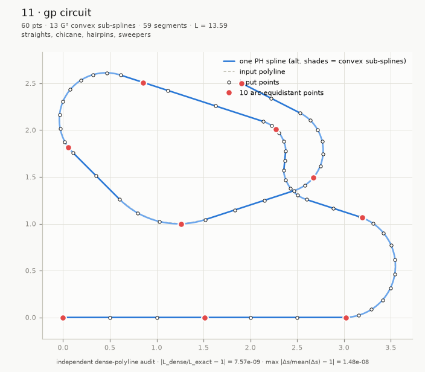
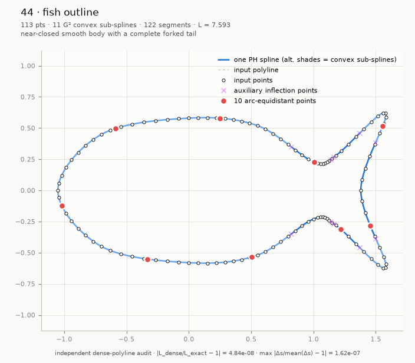
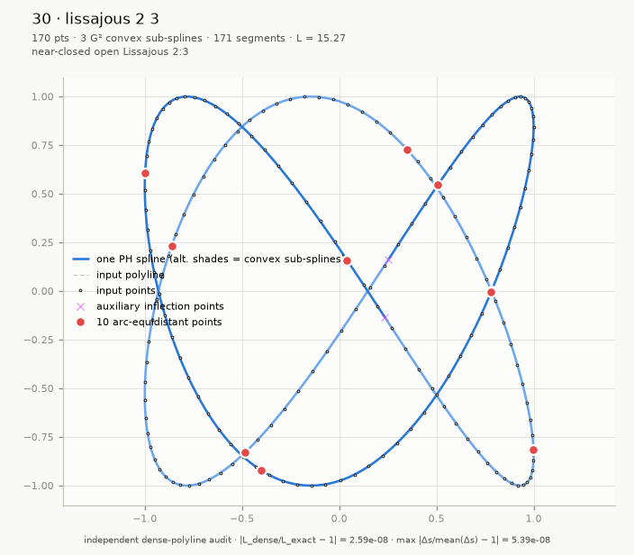
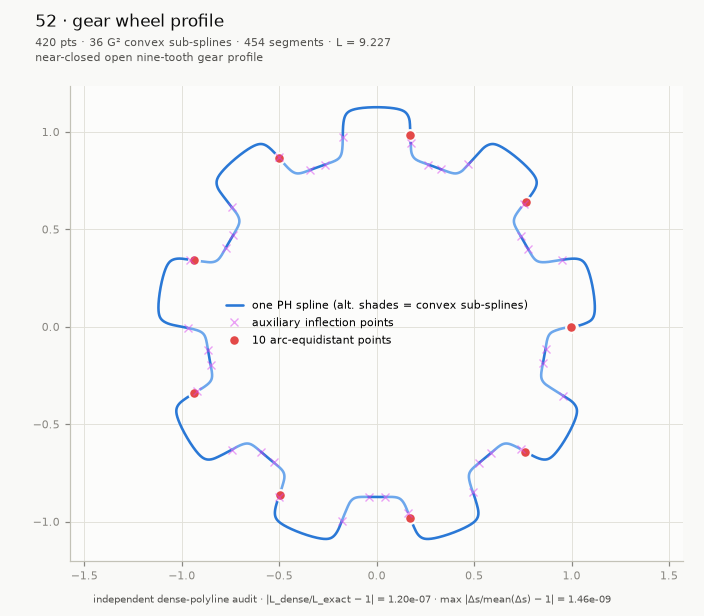
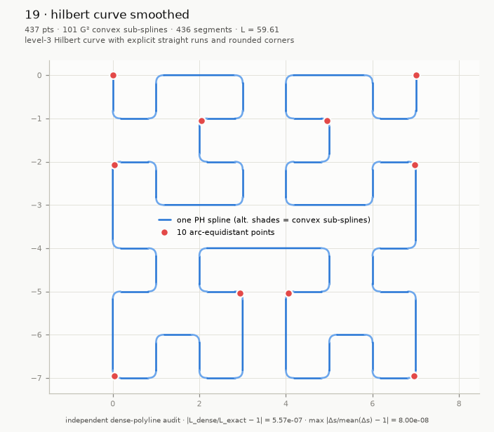
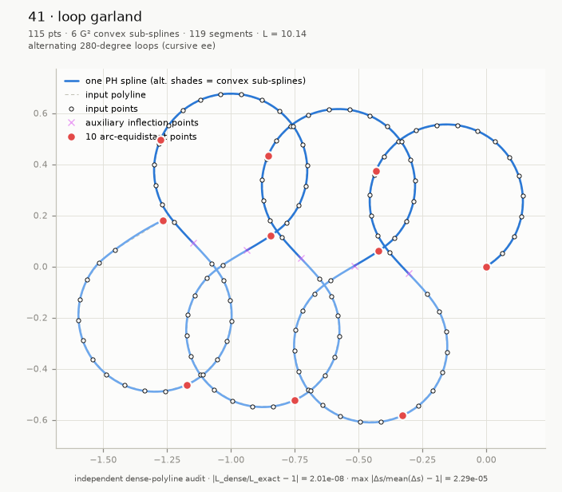
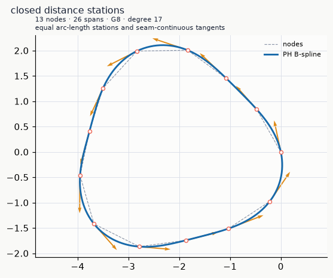
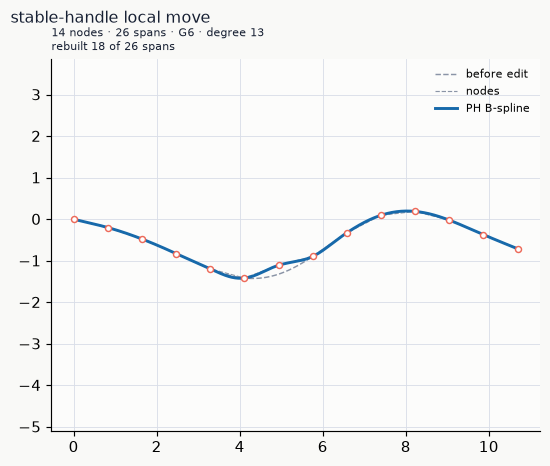

# PH Splines

The provided Pythagorean-hodograph (PH) spline objects feature highly efficient, accurate and robust random-distance access through the `point_at_length` API.

- `CubicPHSpline` is highly efficient for static use cases.
- `PHBSpline` supports dynamic editing (moving, adding and deleting nodes) with prescribed continuity-order constraints.

## 1. Cubic PH Spline

Point-interpolating planar **cubic Pythagorean-hodograph (PH) splines** with
verified geometry, exact arc length and fast distance-domain evaluation.


*Locate any position by distance travelled or select two points an exact path
distance apart.*

`CubicPHSpline(points)` accepts convex, collinear and admissible nonconvex
point data directly, without requiring tangent or curvature data. It produces
an immutable regular spline that is G² throughout each convex run and G¹ only
at genuine curvature-sign changes and straight/curved transitions. Every
segment, continuity condition and numerical solve is independently verified
before construction succeeds.

The distinguishing feature is fast, accuracy-verified arc-length evaluation
for splines through arbitrary planar points: `point_at_length(d)` locates the
point reached after travelling `d` units, while queries at `s` and `s + d`
locate two points exactly `d` units of curve length apart. Each query uses one
O(log n) prefix lookup and a constant-cost closed-form inversion with bounded
polishing—without numerical quadrature or geometric search. Its arc-length
residual is verified near binary64 machine precision, and benchmarks remain
about 5-6 µs per query from 100 to 10,000 segments. To the best of our
knowledge, this is the first implementation for arbitrary planar-point splines
to combine closed-form arc-length inversion, near-machine-precision
verification and single-digit-microsecond random distance access.

```python
from ph_spline import CubicPHSpline

curve = CubicPHSpline([[0.0, 0.0], [1.0, 0.4], [2.0, 1.3], [2.6, 2.4]])

curve.point(0.5)               # float64 array (2,)
curve.tangent(0.5)             # unit tangent
curve.normal(0.5, side="left") # unit normal
curve.principal_normal(0.5)    # toward the center of curvature
curve.signed_curvature(0.5)    # float (sign = turning direction)
curve.curvature_vector(0.5)    # kappa * N_left
curve.aux_inflection_points    # [] (none inserted for this convex input)

L = curve.arc_length(1.0)      # exact (closed form, compensated prefix sums)
u = curve.parameter_at_length(0.5 * L)
curve.point_at_length(0.5 * L) # one locate + one inversion
```

### Gallery

| | |
|---|---|
|  |  |
| *One nonconvex racing-circuit spline.* | *Near-closed open fish outline.* |
|  |  |
| *Near-closed Lissajous 2:3.* | *Near-closed nine-tooth gear profile.* |
|  |  |
| *Hilbert path with supported straights and rounded corners.* | *Alternating 280-degree loops with verified global arc-length inversion.* |

### Where distance-domain evaluation matters

Fast, verified distance queries matter wherever work must be scheduled or
distributed uniformly along a path: contour design, CNC and robot motion,
autonomous navigation, constant-speed animation, spatial and GIS queries,
collision sampling, physical simulation, sensing, inspection, and placement
of textures, annotations or material along a curve.

### Background

Write a planar polynomial curve as `z(t) = x(t) + iy(t)`, with velocity
`z'(t)`. Its speed `sqrt(x'(t)^2 + y'(t)^2)` is generally not polynomial. A PH
curve instead makes `|z'(t)|^2 = x'(t)^2 + y'(t)^2 = sigma(t)^2`, so speed and
its arc-length integral are polynomials.

This implementation joins planar cubic PH Bézier segments with complex form
`z'(t) = (a + bt)^2`. Their speed `|a + bt|^2` is quadratic, so arc length is
cubic; distance inversion is one monotone cubic solve, expressible with cube
roots or hyperbolic functions. Bounded Newton iterations only correct rounding.

### Numerical design highlights

- All construction in normalized coordinates (origin `P0`, scale = longest
  chord); hypot-based norms; chord-ratio representability guard.
- Closed-form, bitwise-deterministic nonconvex preprocessing. Auxiliary points
  are clamped to chord fractions `[1/16, 15/16]`; their prescribed tangents are
  never boundary-clamped, and every fallback retains a strictly positive tilt.
- Bounded trust-region tridiagonal solve for the internal tangent angles,
  with machine-precision complex-step Jacobians (three-coloring), a
  deterministic fallback initializer for extreme chord ratios, and a damped,
  box-projected Newton polish. Solver output is never trusted: strict
  independent acceptance (residual gate `1e-11`, regularity, control-polygon
  admissibility, PH reconstruction with conditioning-aware tolerance, and
  per-joint G²/G¹ verification) follows every solve.
- Cancellation-resistant closed forms throughout: `sinc`-based angle ratios,
  rationalized quadratic roots chosen per branch sign, completed-square arc
  length, scaled hyperbolic/Cardano depressed-cubic inversion with
  factored recovery of `t` (never `y - h`), end-reversed inversion near
  `t = 1`, safeguarded Newton with a fixed iteration bound and an explicit
  arc-length residual gate `64 eps L + 4 ulp(s)`.
- Works verified from coordinate magnitudes `1e-150` to `1e307`, curvatures
  `1e-12` to `1e12`, chord ratios down to ~`5e-13`, and systems beyond 1000
  segments (sparse banded path).

### API

All parameters and lengths are Python or NumPy real scalars. Coordinates and
vectors are returned as NumPy `float64` arrays of shape `(2,)`.

| Call | Result |
|---|---|
| `CubicPHSpline(points)` | Construct an immutable open spline from an `(n, 2)` point sequence. |
| `point(u)` | Position at global parameter `u` in `[0, 1]`. |
| `tangent(u)` | Unit traversal tangent. |
| `normal(u, side="left")` | Unit left or right normal. |
| `principal_normal(u)` | Unit normal toward the center of curvature; undefined on a straight segment. |
| `signed_curvature(u)` | Signed scalar curvature. |
| `curvature_vector(u)` | Left normal multiplied by signed curvature. |
| `aux_inflection_points` | Algorithm-inserted inflection points as `{"u", "s", "x", "y"}` dicts. |
| `arc_length(u)` | Length from the start through parameter `u`. |
| `parameter_at_length(s)` | Parameter whose prefix length is `s`, for `s` in `[0, arc_length(1)]`. |
| `point_at_length(s)` | Position at prefix length `s`. |

All package exceptions derive from `CubicPHSplineError`. Invalid input and
query arguments also derive from `ValueError`; numerical construction and
inversion failures also derive from `RuntimeError`. Construction exceptions
provide `index`, `quantity`, `value`, and `bound` diagnostic attributes.

### Benchmarks

`python benchmarks/benchmark.py` compares a strictly convex log spiral with a
one-inflection cubic S curve, best of three on Windows 11 / Python 3.14.6 /
NumPy 2.x. Both paths include their complete construction and verification
contracts. Queries use seeded uniform arc lengths.

| kind | points | segments | aux | construction | 1000 × `point_at_length` | per query |
|:-----|-------:|---------:|----:|-------------:|-------------------------:|----------:|
| convex | 100 | 99 | 0 | 0.022 s | 5.8 ms | 5.8 µs |
| nonconvex | 100 | 100 | 1 | 0.022 s | 5.7 ms | 5.7 µs |
| convex | 1 000 | 999 | 0 | 0.029 s | 5.7 ms | 5.7 µs |
| nonconvex | 1 000 | 1 000 | 1 | 0.047 s | 5.7 ms | 5.7 µs |
| convex | 10 000 | 9 999 | 0 | 0.373 s | 6.1 ms | 6.1 µs |
| nonconvex | 10 000 | 10 000 | 1 | 0.337 s | 5.8 ms | 5.8 µs |

Construction stays in the same range for the two contracts. Query cost is
nearly flat over the tested sizes: one O(log n) prefix search plus one
constant-cost elementary local inversion, never an iterative geometric search.

## 2. PH B-spline

`PHBSpline` is the editable, variable-order counterpart: it accurately interpolates open
or closed planar point sequences, verifies the requested continuity and
regularity before publication, and retains analytic PH speed and arc-length
polynomials on every span. The default request is G²; `g_order`, `c_order` and
`curvature_order` select higher geometric, parametric or arc-length-curvature
continuity. The minimum sufficient preimage order is selected directly as
`max(2, g_order, c_order, curvature_order + 2)`, giving PH degree
`2 * order + 1`; a simple midpoint knot supplies shape freedom without
inflating that degree.

```python
import numpy as np
from ph_spline import PHBSpline

curve = PHBSpline(
    [[0.0, 0.0], [1.0, 0.4], [2.0, -0.7], [3.0, 1.1], [2.2, 2.0]],
    g_order=4,
)

# Analytic distance access is retained at variable degree.
midpoint = curve.point_at_length(0.5 * curve.length)

# Derivatives are full vectors of arbitrary configured order.
velocity = curve.derivative(0.4)
intrinsic_jet = curve.jet(0.4, 6, wrt="arc_length")
curvature_jet = curve.curvature_vector_jet(0.4, 4)

# Handles survive insertion and index shifts; edits commit atomically.
handle = curve.point_handle(2)
report = curve.move_point(handle, [2.1, -0.9])
inserted = curve.insert_point(3, [2.6, 0.1])
curve.delete_point(inserted.handle)

# Several edits can share one verified commit.
with curve.edit() as edit:
    edit.move_point(handle, [2.0, -0.8])
    edit.insert_point(3, [2.5, 0.2])

snapshot = curve.snapshot(compact=True)  # immutable query-only view
stations = snapshot.points_at_length(
    np.linspace(0.0, snapshot.length, 1000), assume_sorted=True
)
```

### Editing and higher-order geometry

Move, insertion and deletion rebuild a bounded coefficient neighborhood and
structurally share unchanged span arrays. Stable `PointHandle` values are not
renumbered by insertion; deleted handles and pre-edit `CurveLocation` values
raise typed stale-reference errors. `repair="strict_local"` is the default and
never silently becomes a global rebuild. `repair="expand"` admits a larger
configured patch, while `repair="global"` makes full reconstruction explicit.
Failed edits leave points, handles, spans, version and cached metric data
unchanged.

`derivative(u, order, wrt=...)` evaluates parameter or intrinsic arc-length
derivatives. `curvature_vector(u, order)` returns derivatives of the complete
curvature vector—not only derivatives of scalar curvature—and
`curvature_vector_jet` shares one Taylor-series recurrence. The elementary
Bernstein/preimage product identities are used directly; finite-difference
geometry and numerical quadrature are absent from these kernels.

| PH B-spline call | Purpose |
|---|---|
| `PHBSpline(points, closed=False, g_order=...)` | Construct and independently verify a variable-order interpolant. |
| `derivative(u, order, wrt="parameter")` | Arbitrary-order parameter derivative vector. |
| `jet(u, order, wrt="arc_length")` | Position and a shared intrinsic derivative jet. |
| `curvature_vector(u, order)` | Arc-length derivative of the full curvature vector. |
| `move_point(handle, xy)` | Strict-local atomic node move with an `EditReport`. |
| `insert_point(index, xy)` / `delete_point(handle)` | Edit topology without renumbering retained handles. |
| `with curve.edit() as edit:` | Batch several mutations into one verified commit. |
| `location_at_length(s)` / `advance_by_length(location, ds)` | Edit-versioned local distance traversal. |
| `snapshot(compact=True)` | Immutable query view unaffected by later edits. |

### PH B-spline gallery

The isolated [`examples/bspline`](examples/bspline) directory contains
generators and rendered output for all 224 referenced input cases, plus 128 PH
B-spline-specific cases in eight feature families. Cubic-specific examples are
kept separately in [`examples/cubic`](examples/cubic).

| | |
|---|---|
|  |  |
| *A closed, symmetric radial zigzag star built from degree-17 G8 PH spans.* | *A closed curve with equal arc-length stations.* |
|  |  |
| *A handle-based G2 move recompiles ten local spans.* | *The G8 second arc-length derivative: the centripetal-force vector.* |

### Numerical design

- Construction uses a translated and scaled complex frame, a degree exactly
  deduced from the continuity request, one simple midpoint knot per input
  interval, analytic PH displacement constraints and an independent
  post-build interpolation/continuity check.
- Each immutable span stores one authoritative Bernstein preimage. Position,
  speed and forward/reverse arc coefficients follow from finite Bernstein
  products and antiderivatives.
- Regularity is certified by recursively bounding the distance from the
  origin to Bernstein control boxes; sampling is used only for branch ranking.
- High-order join evaluation retains canonical endpoint preimage jets, which
  avoids catastrophic cancellation in alternating Bernstein differences.
- Arc inversion starts from a monotone per-span lookup bracket and applies
  bounded safeguarded Newton correction. Only stable Bernstein evaluation can
  satisfy the final near-binary64 forward residual gate.
- Global construction or an edit either returns a finite, verified curve or a
  structured `PHBSplineError`; continuity and degree are never downgraded.

### Benchmarks: size and shape

`python benchmarks/benchmark_bspline.py` prints all three tables below. These
construction figures are best-of-two below 10,000 nodes and single-run at
10,000 nodes; distance-query figures are best-of-three measurements on a
13th Gen Intel Core i9-13900K running Windows 11, Python 3.14.6, NumPy 2.5.1
and SciPy 1.18.0.
Each random distance result includes lookup, analytic polynomial inversion,
forward residual acceptance and point evaluation.

| kind | nodes | spans | construction | `point_at_length` |
|:--|--:|--:|--:|--:|
| convex | 100 | 198 | 0.0367 s | 52.18 µs |
| nonconvex | 100 | 198 | 0.0365 s | 50.44 µs |
| convex | 1,000 | 1,998 | 0.3603 s | 41.94 µs |
| nonconvex | 1,000 | 1,998 | 0.3326 s | 42.04 µs |
| convex | 10,000 | 19,998 | 3.3860 s | 41.48 µs |
| nonconvex | 10,000 | 19,998 | 3.4056 s | 42.73 µs |

Random distance access remains nearly flat as span count grows; its higher
constant than `CubicPHSpline` buys variable degree, generic regular geometry
and editable state.

### Benchmarks: higher continuity

The second sweep fixes 1,000 nodes and raises the verified continuity request.
Both construction and distance-query cost rise with polynomial degree, rather
than with a hidden iterative quadrature tolerance.

| continuity | PH degree | construction | `point_at_length` |
|:--|--:|--:|--:|
| G3 | 7 | 0.4357 s | 52.96 µs |
| G4 | 9 | 0.5532 s | 65.27 µs |
| G6 | 13 | 0.8433 s | 107.40 µs |
| G8 | 17 | 1.2068 s | 136.22 µs |

### Benchmarks: dynamic editing

These are median end-to-end latencies from seven warmed calls to the public
editing API. They include validation, candidate construction, independent
verification and atomic commit. Exterior span polynomials, arc-length tables
and inverse kernels remain bitwise shared. A Gρ edit rebuilds `2(ρ + 3)`
compiled spans: 10/14/22 for G2/G4/G8. The current flat-array commit path still
performs O(n) validation, prefix rebuilding and publication, so the table
reports actual user-visible latency rather than presenting bounded numerical
recompilation as total-size-independent execution.

| nodes | continuity | median move | median insert | median delete | rebuilt spans |
|--:|:--|--:|--:|--:|:--|
| 100 | G2 | 3.25 ms | 3.48 ms | 3.44 ms | 10/10/10 |
| 100 | G4 | 5.48 ms | 5.78 ms | 5.82 ms | 14/14/14 |
| 100 | G8 | 15.25 ms | 15.47 ms | 15.51 ms | 22/22/22 |
| 1,000 | G2 | 7.88 ms | 10.88 ms | 10.54 ms | 10/10/10 |
| 1,000 | G4 | 10.40 ms | 13.23 ms | 13.63 ms | 14/14/14 |
| 1,000 | G8 | 19.34 ms | 22.98 ms | 22.18 ms | 22/22/22 |
| 10,000 | G2 | 59.40 ms | 92.70 ms | 90.10 ms | 10/10/10 |
| 10,000 | G4 | 60.02 ms | 91.87 ms | 94.83 ms | 14/14/14 |
| 10,000 | G8 | 70.99 ms | 104.99 ms | 102.33 ms | 22/22/22 |

## References

- Jaklič, Kozak, Krajnc, Vitrih and Žagar, [*On interpolation by planar cubic
  G² Pythagorean-hodograph spline curves*](https://users.fmf.uni-lj.si/knez/clanki/CubicPHG2Spline-rev.pdf).
- Albrecht, Beccari, Canonne and Romani, [*Pythagorean-Hodograph B-Spline
  Curves* (PDF)](https://arxiv.org/pdf/1609.07888) and
  [abstract/metadata](https://arxiv.org/abs/1609.07888).
- Farouki, [*Arc lengths of rational Pythagorean-hodograph
  curves*](https://escholarship.org/content/qt90s84043/qt90s84043.pdf).
- Farouki and Sakkalis, [*Real rational curves are not ‘unit
  speed’*](https://doi.org/10.1016/0167-8396(91)90040-I).
- Knez, Pelosi and Sampoli, [*Construction of G² planar Hermite interpolants
  with prescribed arc lengths*](https://arxiv.org/pdf/2202.11371).
- Gajny, Béarée, Nyiri and Gibaru, [*Path planning with PH G² splines in
  R²*](https://doi.org/10.1109/IConSCS.2012.6502455).
